# Lecture 3: Planning Deep Dive
## ReAct, Reflexion, Tree of Thoughts, LATS — and the Patterns That Came After

**AI Systems Engineering for Agentic Workflows — Module 1: Foundations**

---

> **Core Thesis**
>
> *Planning is search. The algorithms in this lecture differ in topology and evaluation signal — not in kind. Choosing a planning algorithm is a first-class economic decision, not a research preference.*

---

## Before You Start: Where This Fits

Lectures 1 and 2 established **what an agent is** — a reasoning core with memory, tools, and a goal.

This lecture answers **what an agent does** when it decides its next step, and why that decision mechanism determines whether the agent is reliable, cheap, or broken in production.

All agent reasoning operates within a common loop:

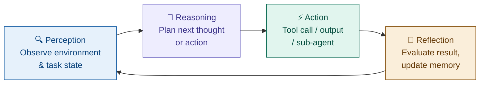

This is the **PRAR loop** — Perception, Reasoning, Action, Reflection. Every planning algorithm in this lecture is a different strategy for navigating this loop.

---

## Section 0 — Why Pure Reasoning Fails

Before the algorithms, let's establish the problem they all solve.

You ask an AI assistant: *"What's the total price for customer Alice buying a Laptop Pro X1?"*

The model knows maths. It knows what discounts are. So it reasons:

```
Thought: The laptop probably costs around $1,200 — it's a Pro model.
Thought: Alice is a premium customer, so she likely gets 15% off.
Thought: 1200 × 0.85 = $1,020.
Thought: Premium customers also get free express shipping (~$15).
Response: $1,020 with free shipping included.
```

This looks reasonable. **Every number in that response was invented.** The model never checked the actual price, never looked up Alice's discount tier, and made up the shipping policy.

This is **hallucination** — the core failure mode of pure reasoning:

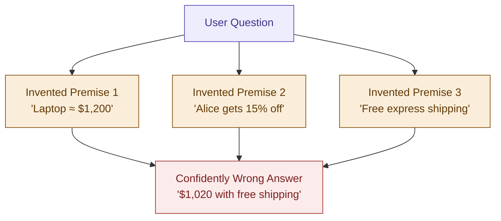

**Chain-of-Thought (CoT)** prompting — asking the model to "think step by step" — helps with structure but does not solve this. The model still reasons entirely from training data and its own prior thoughts. There is no moment where it touches the real world.

**This is the gap every planning algorithm in this lecture addresses.** Each algorithm answers the same question differently: *how does the agent check its reasoning against reality?*

---

## Section 1 — Planning as Search: The Unifying Idea

Think of planning like navigating a maze. At every junction you have choices. A planning algorithm is the strategy you use to explore those choices.

| Algorithm | Maze Analogy | Core Mechanism |
|---|---|---|
| **ReAct** | Commit to one path; check reality at each step | Tool-grounded observation |
| **Reflexion** | Try the whole maze; fail; think; retry smarter | Verbal self-critique |
| **Tree of Thoughts** | Map nearby junctions before committing | Local LLM scorer |
| **LATS** | Simulate each path all the way to the exit | Full rollout (MCTS) |

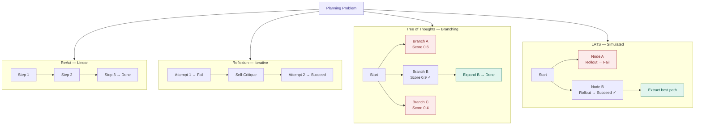

---

## Section 2 — The Four Core Algorithms

---

### 2.1 ReAct — Check Reality at Every Step

**Paper:** Yao et al., ICLR 2023 — *ReAct: Synergizing Reasoning and Acting in Language Models*
**Origin:** Princeton + Google

#### The Core Idea

ReAct solves hallucination in the simplest possible way: after every reasoning step, the agent does something in the real world and reads back what actually happened.

Instead of reasoning all the way to an answer internally, the agent alternates:

- **Thought** — what do I need to know next?
- **Action** — look it up (call a tool)
- **Observation** — here is what the tool actually returned

**The model cannot hallucinate a tool result, because the real result replaces whatever the model might have imagined.**

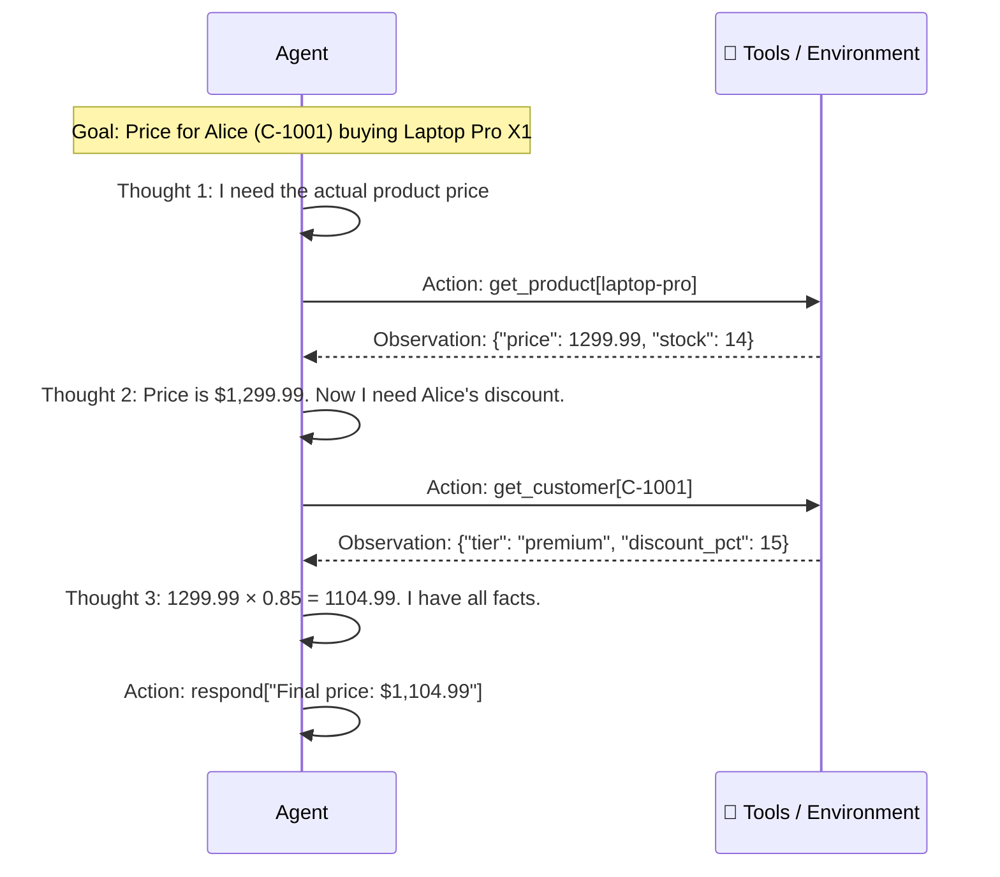

Compare this to the pure CoT version. Every number in the ReAct trace is real — pulled from an actual data source. Reasoning is anchored to facts at each step.

#### The Analogy: Detective Work

Pure CoT is like sitting in your office and guessing who did it based on what feels plausible. ReAct is like going to the crime scene, interviewing witnesses, and checking evidence at each reasoning step.

#### Failure Modes

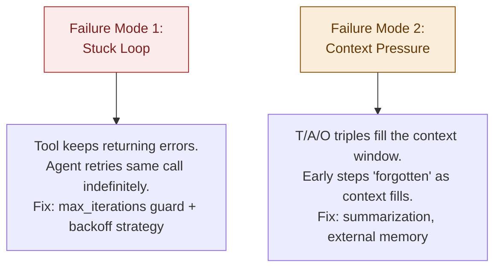

**The Stuck Loop in code:**
```
Thought:     I need to find the customer's order history.
Action:      get_order_history[C-1001]
Observation: {"error": "Service temporarily unavailable"}

Thought:     Still unavailable. I'll try once more.
Action:      get_order_history[C-1001]   ← loops indefinitely
```

This is why `max_iterations` guards and stuck-loop detection are necessary production requirements, not optional features.

#### Why ReAct Is the Default Everywhere

ReAct is the backbone algorithm in LangChain, LangGraph, Strands, and AutoGen — not because it scores highest on benchmarks, but because it gives the best **reliability-to-cost ratio** for the widest class of real-world tasks.

---

### 2.2 Reflexion — Learn from Failure

**Paper:** Shinn et al., NeurIPS 2023 — *Reflexion: Language Agents with Verbal Reinforcement Learning*

#### The Problem ReAct Doesn't Solve

ReAct fixes hallucination within a single run. But if you run a ReAct agent on the same task twice and it fails both times for the same reason — it has no memory of what went wrong in attempt 1. It starts fresh every time.

This is exactly how humans *don't* learn. When you burn a dish, you remember and do it differently next time. Reflexion gives agents the same capability.

#### The Core Idea

When an agent fails, instead of giving up, it:

1. Writes a plain-English explanation of *why* it failed
2. Stores that explanation in a memory buffer
3. On the next attempt, reads the explanation first and avoids the same mistake

No model retraining. No gradient updates. Just: write down what went wrong, then read it before you try again.

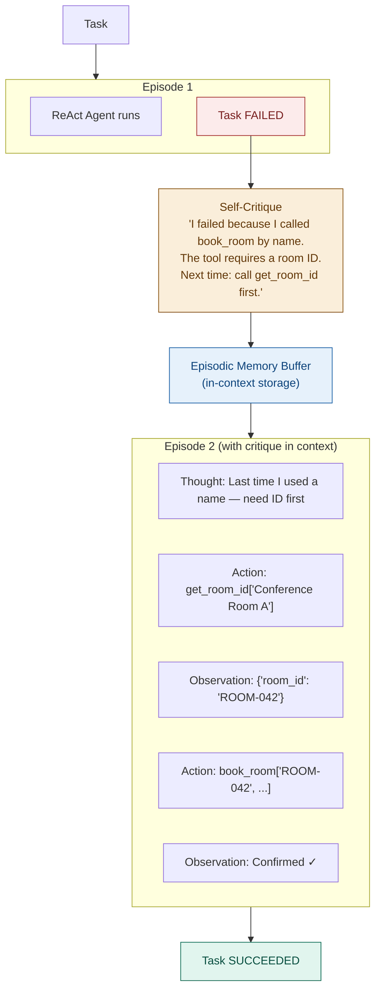

#### The Analogy: Writing Notes to Your Future Self

Reflexion is like writing a note after making a mistake: *"Future me — don't do X again. Do Y instead."* The next time you face the same problem, you read your own note first.

This works extremely well when:
- The task is **repeatable** (you can attempt it multiple times)
- The failure is **diagnosable** (you can articulate what went wrong)
- The failure pattern is **consistent** (the same mistake will happen again if uncorrected)

#### Critical Weakness: Self-Evaluation

The entire mechanism depends on the quality of the self-critique. If the agent misdiagnoses why it failed, the buffer becomes actively harmful — it teaches the wrong lesson.

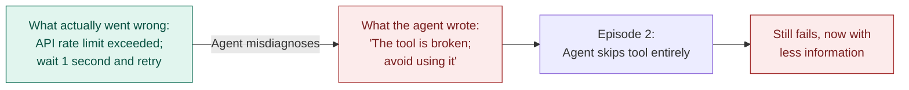

> **The fundamental weakness of self-evaluation**: the same model that made the error is evaluating why it happened. We return to this in LATS.

#### Memory Architecture Note

Reflexion's critique buffer lives in the context window — it is *in-context storage* from the Lecture 2 taxonomy. When the session ends, the buffer is gone unless you explicitly save it. A production Reflexion system must decide: do we persist lessons learned across sessions? This is an architectural decision with real cost and retrieval complexity.

---

### 2.3 Tree of Thoughts — Explore Before You Commit

**Paper:** Yao et al., NeurIPS 2023 — *Tree of Thoughts: Deliberate Problem Solving with Large Language Models*

#### The Problem Reflexion Doesn't Solve

Both ReAct and Reflexion follow a single path at a time. They commit to one sequence of actions and see where it leads. This fails when the problem has many genuinely viable approaches and picking the wrong first step costs a lot.

Imagine writing an essay with three possible thesis arguments. ReAct picks one and writes the whole essay. If the thesis was weak, you have a weak essay — and you never knew if the others would have been better.

ToT lets you sketch all three theses, evaluate them before writing a single paragraph, and only expand the most promising one.

#### The Core Idea

ToT treats reasoning as a tree:
- Each **node** is a partial answer — a step toward the goal
- Each **branch** is a different way to proceed from that point
- Before expanding a branch, a **scoring step** estimates how promising it looks

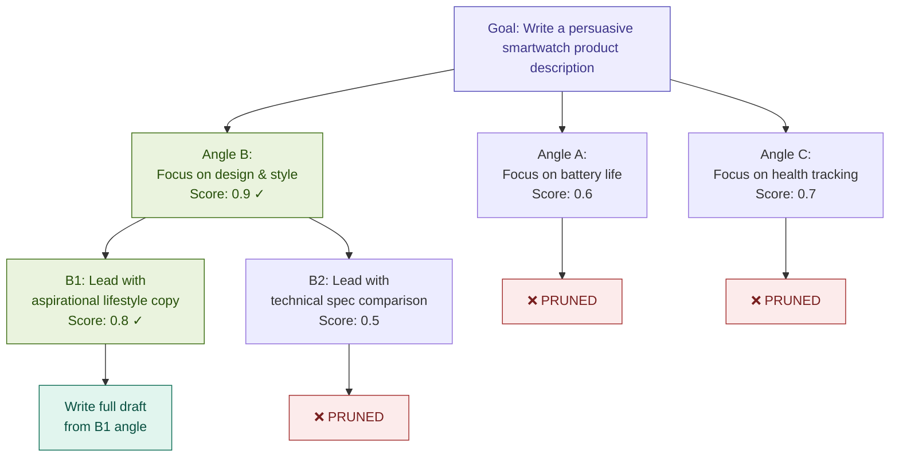

#### BFS vs DFS: Two Ways to Traverse the Tree

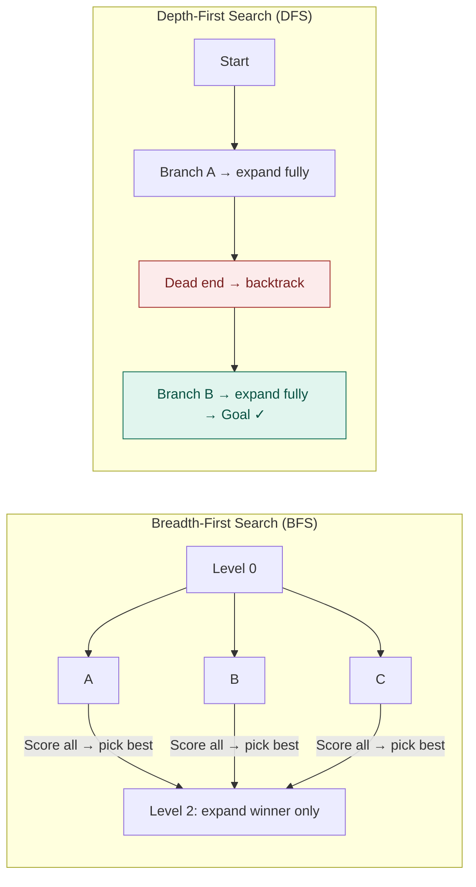

| | BFS | DFS |
|---|---|---|
| **When to use** | Early steps not strongly predictive of final quality | Early steps strongly determine downstream outcomes |
| **Analogy** | Interview all candidates before advancing any | Follow one chess move sequence to checkmate, then backtrack |
| **Risk** | Higher breadth cost | May commit deeply to a bad first choice |

#### The Evaluator: The Critical Design Decision

The scoring step is what makes ToT work — and also its biggest risk. Three options:

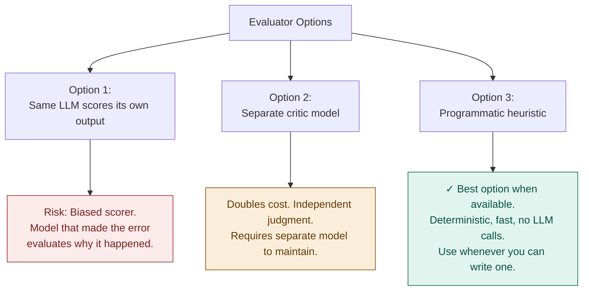

**Use programmatic evaluation whenever you can define one.** It is the most reliable option.

#### Token Cost Reality

```
Branching factor b = 3, Depth d = 4:

Nodes = b^d = 3^4 = 81 reasoning paths
Each node: 1 generation + 1 evaluation = 2 LLM calls
Total: 81 × 2 = 162 LLM calls

Compare to ReAct on the same task: ~8–12 calls
ToT ≈ 15× more expensive
```

**Rule of thumb**: use ToT when the branching point is early, the evaluator can prune effectively, and the cost of a wrong first step is worth the exploration overhead.

---

### 2.4 LATS — Simulate Before You Commit

**Paper:** Zhou et al., ICML 2024 — *Language Agent Tree Search Unifies Reasoning, Acting, and Planning*

#### The Problem Tree of Thoughts Doesn't Solve

ToT scores nodes with a *local* evaluator — it looks at a partial solution and asks "does this look promising?" But a step can look great locally and still lead to failure downstream.

Imagine planning a road trip. You pick Route A because the first 10 miles look great on the map. But 50 miles in, Route A hits major construction and adds 3 hours. You never knew — you only evaluated the first 10 miles.

**What if you could run a simulation of each route all the way to the destination before leaving?** That is LATS.

#### The Core Idea

LATS combines ToT's tree structure with a different evaluation strategy: instead of scoring a node with a local heuristic, LATS **runs the agent to completion** from that node (called a *rollout*) and uses the actual outcome to judge how good the node was.

- Node looks good → run to completion → task **fails** → node is down-scored
- Node looks mediocre → run to completion → task **succeeds** → node is up-scored

The score is reality-tested, not estimated.

#### The Four MCTS Phases

LATS is built on Monte Carlo Tree Search (MCTS) — the same algorithm that powered AlphaGo.

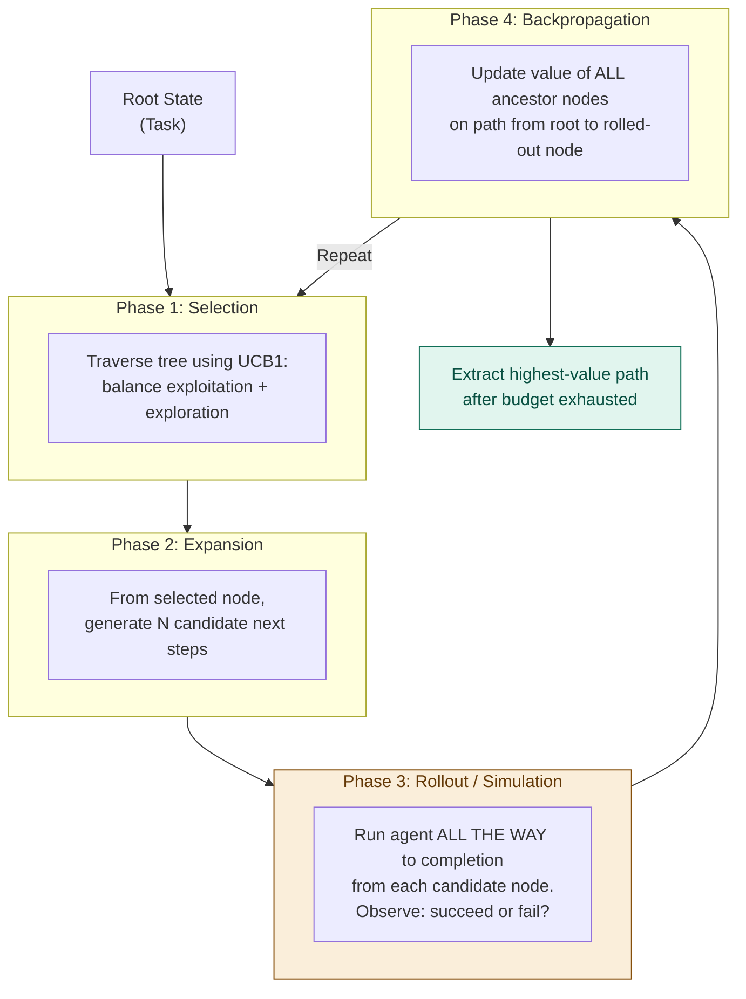

#### UCB1 — Balancing Exploration and Exploitation

The **UCB1 formula** decides which node to expand next:

```
UCB1 score = average_reward + C × sqrt( ln(parent_visits) / node_visits )
              ↑ how good this node                ↑ bonus for being under-explored
              looked in past rollouts
```

In plain English: *"Pick the node that looks good — but give a bonus to nodes we haven't tried enough to be sure about."*

#### LATS vs ToT: A Concrete Rollout Example

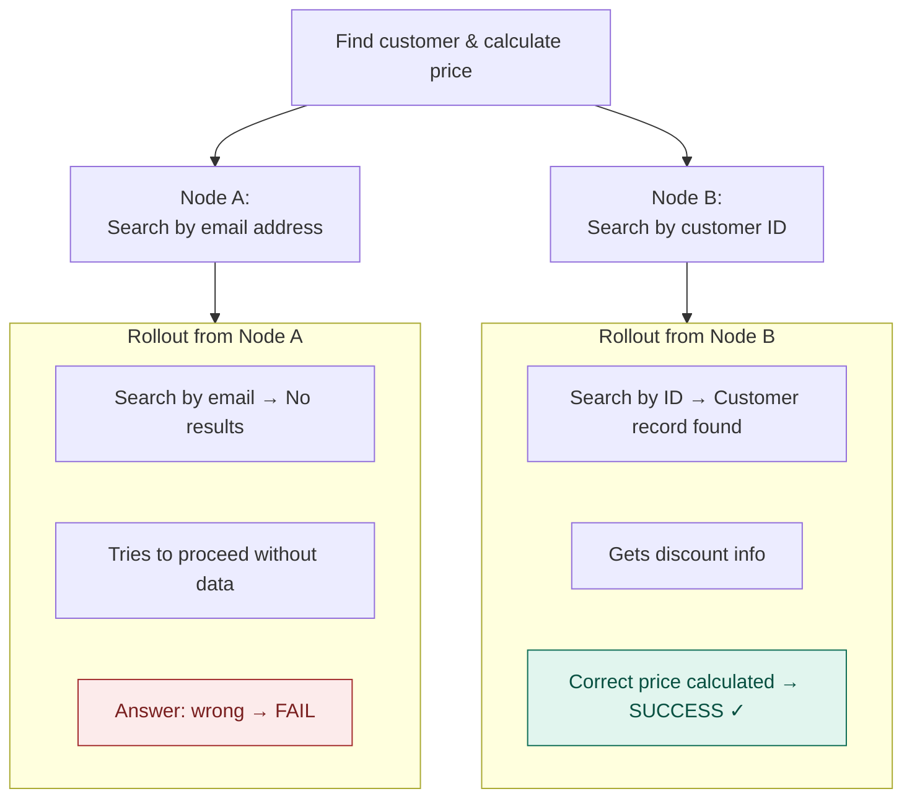

Node B wins — not because it looked better in isolation, but because we actually tested it end-to-end.

#### Backpropagation in Practice

```
After Rollout (Node B path: Root → A → A2 → B → SUCCESS):

  Node B:   visits += 1,  reward += 1.0
  Node A2:  visits += 1,  reward += 0.9
  Node A:   visits += 1,  reward += 0.8
  Root:     visits += 1

Over many rollouts, value estimates converge toward an
accurate picture of which early decisions lead to success.
```

#### Cost Reality

```
1 LATS run on a 4-step task, b=3:
  81 nodes to potentially explore
  Each node: 1 expansion + 1 full rollout (~5–10 LLM calls)
  Total: ~81 × 8 = ~648 LLM calls

Compare to ReAct: ~8–12 calls
LATS ≈ 50–80× more expensive
```

This is not a rounding error — it is a fundamental cost structure.

#### When LATS Is Worth It

LATS is justified when **all three** of the following are true:

1. The task is **long-horizon** — many dependent steps
2. **Early decisions have large downstream consequences** — wrong first step cannot easily be corrected
3. **The cost of a wrong answer exceeds the cost of compute** — medical, legal, financial, security-critical outputs

---

## Section 3 — Full Side-by-Side Comparison

The same task — *"Research the three best open-source LLMs for coding tasks and write a comparison"* — through all four algorithms:

```mermaid
flowchart TD
    Task3["Research Task:\nTop 3 open-source coding LLMs"]

    subgraph RA["ReAct — 8–12 calls"]
        RA_1["Search for top LLMs"]
        RA_2["Look up benchmarks"]
        RA_3["Look up licenses"]
        RA_4["Write comparison"]
        RA_1 --> RA_2 --> RA_3 --> RA_4
    end

    subgraph RF["Reflexion — 2× ReAct"]
        RF_1["Ep 1: Uses wrong metric → shallow"]
        RF_C["Critique: use LiveCodeBench not HumanEval"]
        RF_2["Ep 2: Correct benchmarks → better output"]
        RF_1 --> RF_C --> RF_2
    end

    subgraph TT["ToT — 40–80 calls"]
        TT_1["Generate 3 structures\nA: by benchmark | B: by use-case | C: by popularity"]
        TT_2["Score: A=0.8, B=0.7, C=0.4 → prune C"]
        TT_3["Expand A → tabular comparison wins"]
        TT_1 --> TT_2 --> TT_3
    end

    subgraph LT["LATS — 200–400 calls"]
        LT_1["Expand 3 structural approaches"]
        LT_2["Run complete rollout for each\n(draft the full comparison)"]
        LT_3["Read all 3 drafts\nBackpropagate quality scores"]
        LT_4["Pick highest-scoring approach\nRefine and finalize"]
        LT_1 --> LT_2 --> LT_3 --> LT_4
    end

    Task3 --> RA & RF & TT & LT

    style RA_4 fill:#E1F5EE,stroke:#0F6E56,color:#085041
    style RF_2 fill:#E1F5EE,stroke:#0F6E56,color:#085041
    style TT_3 fill:#E1F5EE,stroke:#0F6E56,color:#085041
    style LT_4 fill:#E1F5EE,stroke:#0F6E56,color:#085041
```

---

## Section 4 — Cost, Capability, and the Selection Guide

### 4.1 Cost Comparison

| Algorithm | LLM Calls (typical) | Cost vs. ReAct | Best for |
|---|---|---|---|
| **ReAct** | 5–15 | 1× (baseline) | Default — grounded, reliable, fast |
| **Reflexion** | 2–5 × ReAct | 2–5× | Repeatable tasks with diagnosable failure patterns |
| **Tree of Thoughts** | 50–200 | 10–30× | Multiple viable approaches; reliable evaluator available |
| **LATS** | 200–600+ | 30–80× | Long-horizon, high-stakes, cost of wrong > cost of compute |

### 4.2 Capability Comparison

| Algorithm | Hallu-cination Fix | Multi-path Explore | Self-correction | Reality-tested Score | Memory |
|---|:---:|:---:|:---:|:---:|:---:|
| Pure CoT | — | — | — | — | — |
| ReAct | ✓ | — | — | ✓ (per step) | — |
| Reflexion | ✓ | — | ✓ | — | ✓ |
| Tree of Thoughts | ✓ | ✓ | — | — (estimated) | — |
| LATS | ✓ | ✓ | ✓ | ✓ (rollout) | — |

### 4.3 Algorithm Selection Guide

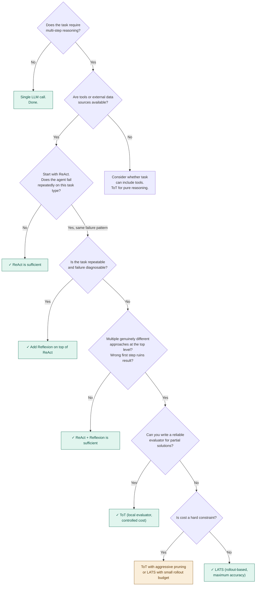

> **The production reality**: ReAct is the most deployed algorithm — not because it scores highest on benchmarks, but because it gives the best reliability-to-cost ratio for the widest class of real-world tasks. If you are building a customer support agent, use ReAct. If you are generating a clinical trial protocol, consider LATS.

---

## Section 5 — Hierarchical Planning: Combining Everything

### The Core Idea

All four algorithms plan at a single level. But most real-world tasks have a high-level structure (what to do) and low-level execution (how to do each thing).

**Hierarchical planning** splits these concerns:

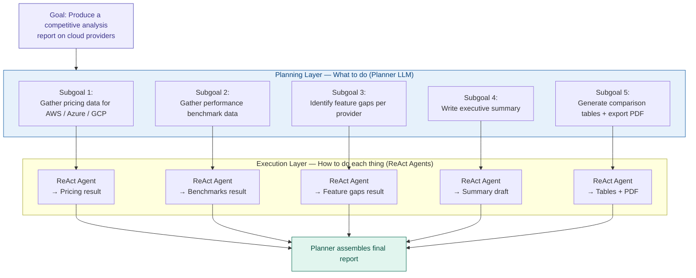

Hierarchical planning is the architectural bridge between single-agent planning (this lecture) and multi-agent systems (Module 2). The planning layer *becomes* an orchestrator agent; execution layers become specialized subagents.

---

## Section 6 — Beyond the Core Four: What Came After

The four algorithms above were discovered through academic research between 2022 and 2024. Since then, the field has produced several important extensions. This section maps where each algorithm sits in the broader evolution.

### 6.1 Architectural Lineage

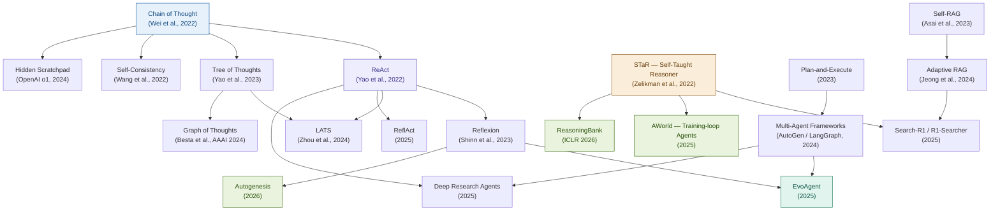

### 6.2 Graph of Thoughts (GoT)

**Paper:** Besta et al., AAAI 2024

GoT is a generalization of ToT that replaces the tree with a **directed acyclic graph (DAG)**. The key difference: two reasoning branches that independently arrive at the same intermediate conclusion can *merge* into a single node, rather than continuing as separate redundant paths.

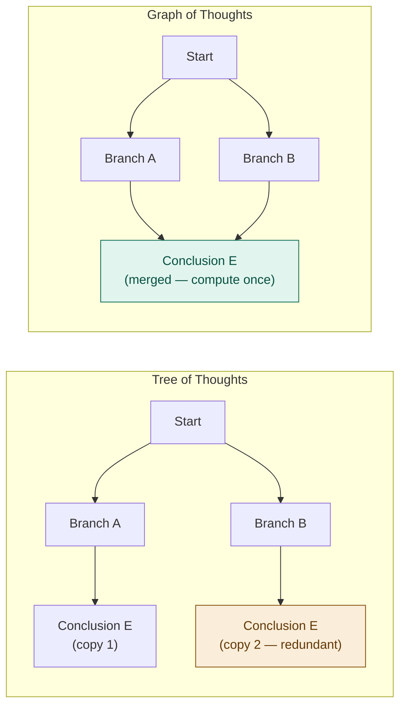

In tasks where multiple valid reasoning approaches converge to the same intermediate result, GoT avoids doing that work twice. More complex to implement than ToT; worth knowing as the next step beyond it.

### 6.3 Self-Ask

**Paper:** Press et al., ICLR 2023

The model decomposes a hard question into follow-up sub-questions ("Are follow up questions needed? Yes. Follow up: ..."), answers each recursively, then synthesizes. Particularly effective for multi-hop QA and retrieval.

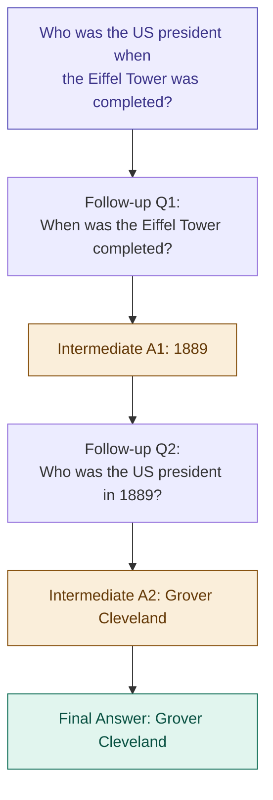

**Pedagogical contrast**: Self-Ask is a clean illustration of sub-question decomposition — different in structure from ReAct's interleaved action loop. Good to use as a contrast case when explaining to students how multiple patterns can address multi-step reasoning differently.

### 6.4 Self-RAG

**Paper:** Asai et al., ICLR 2024

The model decides *when* to retrieve (not always), generates with retrieved passages, then critiques its own answer for relevance and groundedness using special reflection tokens.

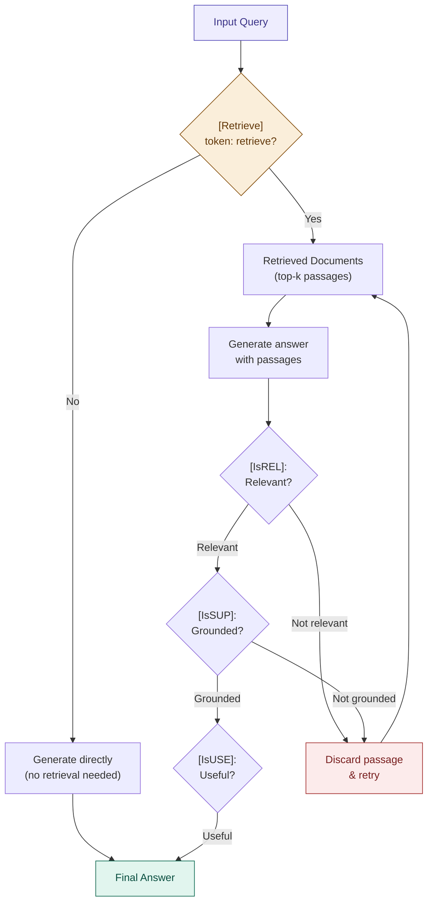

### 6.5 LLM-as-Judge / Actor-Critic

**Survey:** Gu et al., 2024 — *A Survey on LLM-as-a-Judge*

Separates a writer/actor LLM from a judge/critic LLM that scores output against a rubric. Enables automated quality gates without human review — widely adopted in RLHF pipelines and agentic content generation.

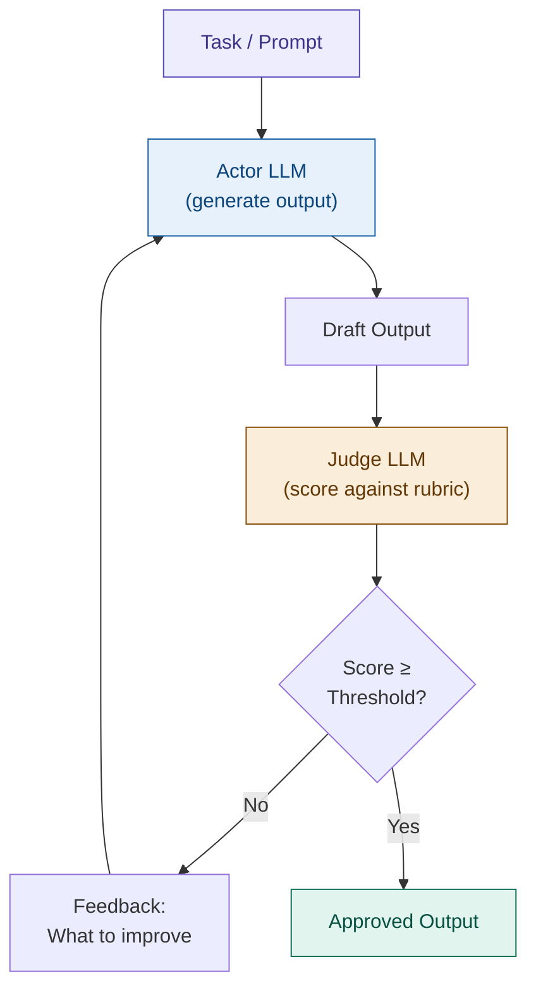

**Connection to Reflexion**: The Judge in Actor-Critic and the self-critique in Reflexion both use LLM evaluation. The key difference: Actor-Critic uses a *separate* model as the judge (independent evaluation), while Reflexion uses the *same* model to evaluate itself (self-evaluation). Independent evaluation is more reliable — see Kambhampati et al. (Discussion Question 4).

### 6.6 Hidden Chain-of-Thought / Scratchpad

**Origin:** OpenAI o1 System Card, 2024

The model reasons privately in a hidden scratchpad before producing a user-facing answer. Preserves all benefits of CoT while hiding raw reasoning in sensitive or user-facing domains.

```mermaid
sequenceDiagram
    participant User
    participant Model
    participant Scratchpad as 🔒 Hidden Scratchpad (not shown to user)

    User->>Model: Complex or sensitive question
    activate Model
    Model->>Scratchpad: Think: break into sub-problems...
    Model->>Scratchpad: Think: check internal consistency...
    Model->>Scratchpad: Think: draft candidate answer...
    Model->>Scratchpad: Think: self-critique draft...
    Model->>Scratchpad: Think: finalize...
    deactivate Model
    Model->>User: Clean final answer only
```

**Connection to the four core algorithms**: Hidden Scratchpad is CoT-inside-the-model. It produces better answers than direct generation (because of intermediate reasoning), but avoids exposing potentially confusing or sensitive reasoning steps to end users.

### 6.7 ReflAct (2025)

**Paper:** arXiv 2505.15182, 2025

Augments ReAct with **goal-state reflection**. At each step the agent checks whether its internal belief state still aligns with the original task goal — not just the last observation. Reduces off-track drift on long-horizon tasks.

```mermaid
flowchart TD
    LHTask["Long-horizon Task\n+ explicit Goal State G"]

    subgraph StdReAct2["Standard ReAct (may drift)"]
        T6["Thought (next action\nbased on last observation)"]
        A6["Action"]
        O6["Observation"]
    end

    subgraph ReflActAdd2["ReflAct Addition"]
        GCheck6{"Belief state B\naligned with goal G?"}
        Realign6["Re-anchor to goal G\nRevise plan before next action"]
    end

    Done6["Task Complete"]

    LHTask --> T6 --> A6 --> O6 --> GCheck6
    GCheck6 -->|"Yes"| T6
    GCheck6 -->|"No — drifted"| Realign6 --> T6
    T6 -->|"Goal reached"| Done6

    style LHTask fill:#EEEDFE,stroke:#534AB7,color:#3C3489
    style GCheck6 fill:#FAEEDA,stroke:#854F0B,color:#633806
    style Realign6 fill:#FCEBEB,stroke:#A32D2D,color:#791F1F
    style Done6 fill:#E1F5EE,stroke:#0F6E56,color:#085041
```

**Why it matters for production**: ReAct on a 30-step task can lose the thread of the original goal as the context fills. ReflAct adds a periodic "check — am I still solving the right problem?" step that is inexpensive but prevents large classes of long-horizon failures.

### 6.8 Search-R1 / R1-Searcher (2025) — The Training-Time Shift

**Papers:** Jin et al. (Search-R1); Song et al. (R1-Searcher), 2025

RL-trained models that learn *when and what* to search within a reasoning trajectory using outcome-based rewards. The model internalizes retrieval timing rather than following explicit prompt instructions.

```mermaid
flowchart LR
    subgraph PromptEra2["Prompt-engineering era (ReAct, 2022)"]
        PE_M["Pretrained LLM"]
        PE_P["Prompt: 'Think → call a tool → observe'"]
        PE_O["Agent behaviour\n(brittle, prompt-sensitive)"]
        PE_M --> PE_P --> PE_O
    end

    subgraph TrainEra2["Training-loop era (Search-R1, 2025)"]
        TL_D["Agentic trajectories\n(with search calls)"]
        TL_R["Outcome-based RL reward\n(final answer correct?)"]
        TL_M["Model with internalized\nretrieval timing"]
        TL_O["Robust agent\n(no special prompting needed)"]
        TL_D --> TL_R --> TL_M --> TL_O
    end

    style PE_O fill:#FAEEDA,stroke:#854F0B,color:#633806
    style TL_O fill:#E1F5EE,stroke:#0F6E56,color:#085041
    style TL_R fill:#EEEDFE,stroke:#534AB7,color:#3C3489
```

**The paradigm shift**: ReAct tells the model *how* to use tools via prompt engineering. Search-R1 trains the model so it *knows* when to search intrinsically. This is the difference between giving someone a manual and teaching them the skill.

### 6.9 EvoAgent / EvoAgentX (2025) — Self-Optimizing Multi-Agent Systems

**Papers:** Yuan et al., ACL 2025; Wang et al., EMNLP 2025

Treats agent prompts and workflow topologies as evolvable genomes. Uses LLM-driven mutation, crossover, and selection to optimize multi-agent systems with minimal human intervention.

```mermaid
flowchart TD
    Init6["Initial Agent Population\n(N agents, varied prompt configs)"]

    Eval6["Evaluate Fitness\n(benchmark task performance)"]
    Sel6["Selection\n(top-k agents survive)"]

    subgraph EvoOps6["Evolutionary Operators (LLM-driven)"]
        Mut6["Mutation:\nprompt-level variation for novelty"]
        Cross6["Crossover:\nmerge role descriptions\nfrom parent agents"]
    end

    New6["New Generation\nof Agent Configs"]
    Conv6{"Converged?"}
    Best6["Optimal Agent Workflow"]

    Init6 --> Eval6 --> Sel6
    Sel6 --> Mut6 & Cross6
    Mut6 & Cross6 --> New6 --> Eval6
    Eval6 --> Conv6
    Conv6 -->|"Yes"| Best6
    Conv6 -->|"No"| Sel6

    style Init6 fill:#E6F1FB,stroke:#185FA5,color:#0C447C
    style Best6 fill:#E1F5EE,stroke:#0F6E56,color:#085041
    style Eval6 fill:#FAEEDA,stroke:#854F0B,color:#633806
```

**Benchmark gains (EvoAgentX):**
- HotPotQA F1: +7.44%
- MBPP pass@1: +10.00%
- GAIA overall: +20.00%

**Why this matters**: EvoAgentX represents the shift from *manually designing* multi-agent workflows to *automatically discovering* the best one for a given task. This directly relates to the multi-agent orchestration patterns you will see in Module 2.

---

## Section 7 — Comprehensive Pattern Taxonomy

### By Reasoning Structure

```mermaid
flowchart TD
    All["All Agentic Reasoning Patterns"]

    Lin["Linear / Sequential"]
    Tree2["Tree / Search-based"]
    Iter["Iterative / Self-improving"]
    Multi6["Multi-agent / Collaborative"]
    Learn["Learned / Training-time"]

    All --> Lin & Tree2 & Iter & Multi6 & Learn

    Lin --> CoT_T["Chain of Thought"]
    Lin --> ReAct_T["ReAct"]
    Lin --> SA_T["Self-Ask"]
    Lin --> PaE_T["Plan-and-Execute"]

    Tree2 --> ToT_T["Tree of Thoughts"]
    Tree2 --> LATS_T["LATS"]
    Tree2 --> GoT_T["Graph of Thoughts"]

    Iter --> Reflex_T["Reflexion"]
    Iter --> SRAG_T["Self-RAG"]
    Iter --> AdRAG_T["Adaptive RAG"]
    Iter --> RA_T["ReflAct"]
    Iter --> DR_T["Deep Research Agents"]

    Multi6 --> MAF_T["Multi-Agent Frameworks"]
    Multi6 --> AC_T["Actor-Critic / LLM-Judge"]
    Multi6 --> Evo_T["EvoAgent / EvoAgentX"]

    Learn --> STaR_T["STaR"]
    Learn --> SR1_T["Search-R1"]
    Learn --> AW_T["AWorld"]
    Learn --> AG_T["Autogenesis"]

    style All fill:#EEEDFE,stroke:#534AB7,color:#3C3489
    style Lin fill:#E6F1FB,stroke:#185FA5,color:#0C447C
    style Tree2 fill:#FAEEDA,stroke:#854F0B,color:#633806
    style Iter fill:#E1F5EE,stroke:#0F6E56,color:#085041
    style Multi6 fill:#EAF3DE,stroke:#3B6D11,color:#27500A
    style Learn fill:#FAECE7,stroke:#993C1D,color:#712B13
```

### Full Pattern Capability Matrix

| Pattern | Year | Tool Use | Self-Critique | Memory | Multi-Agent | Training-time | Evaluation Signal |
|---|:---:|:---:|:---:|:---:|:---:|:---:|---|
| Chain of Thought | 2022 | — | — | — | — | — | Internal only |
| ReAct | 2022 | ✓ | — | — | — | — | External (tool result) |
| STaR | 2022 | — | — | — | — | ✓ | Self-supervised |
| Self-Consistency | 2022 | — | Implicit | — | — | — | Majority vote |
| Tree of Thoughts | 2023 | — | ✓ | — | — | — | LLM scorer (local) |
| Reflexion | 2023 | ✓ | ✓ | ✓ | — | — | Self-critique (verbal) |
| Plan-and-Execute | 2023 | ✓ | — | — | ✓ | — | Task outcome |
| Toolformer | 2023 | ✓ | — | — | — | ✓ | Loss improvement |
| Self-Ask | 2023 | ✓ | — | — | — | — | Sub-question answers |
| Self-RAG | 2023 | ✓ | ✓ | — | — | ✓ | Reflection tokens |
| LATS | 2024 | ✓ | ✓ | — | — | — | Rollout outcome |
| Multi-Agent Frameworks | 2024 | ✓ | ✓ | ✓ | ✓ | — | Task outcome |
| LLM-as-Judge | 2024 | ✓ | ✓ | — | ✓ | — | Independent judge |
| Hidden Scratchpad | 2024 | — | ✓ | — | — | ✓ | Internal (hidden) |
| Adaptive RAG | 2024 | ✓ | ✓ | — | — | — | Answer quality |
| ReflAct | 2025 | ✓ | ✓ | ✓ | — | — | Goal alignment |
| Search-R1 / R1-Searcher | 2025 | ✓ | — | — | — | ✓ | RL outcome reward |
| Deep Research Agents | 2025 | ✓ | ✓ | ✓ | ✓ | — | Research quality |
| EvoAgent / EvoAgentX | 2025 | ✓ | ✓ | ✓ | ✓ | ✓ | Benchmark fitness |
| MCP + Tool Ecosystems | 2025 | ✓ | — | — | ✓ | — | Tool protocol |
| Autogenesis | 2026 | ✓ | ✓ | ✓ | ✓ | ✓ | Self-validated |
| ReasoningBank | 2026 | ✓ | ✓ | ✓ | — | ✓ | Trace retrieval |
| AWorld | 2026 | ✓ | ✓ | ✓ | ✓ | ✓ | End-to-end RL |

---

## Section 8 — Key Concepts Glossary

**Chain-of-Thought (CoT)** — Prompting technique asking the model to reason step by step before giving an answer. Improves structured reasoning but does not prevent hallucination because reasoning is entirely internal — no real-world grounding.

**Hallucination** — When an LLM generates plausible-sounding but factually incorrect information. In planning contexts, hallucinated intermediate results compound into wrong final answers.

**ReAct (Reason + Act)** — Planning pattern alternating Thought, Action, and Observation steps. Grounds every reasoning step in real tool results, preventing hallucination. The default agent planning algorithm in every major framework.

**Reflexion** — Planning extension where a failed episode generates a plain-language self-critique stored in memory. Future attempts prepend the critique and avoid the same mistake. "Verbal reinforcement learning."

**Episodic memory buffer** — In Reflexion, the stored log of self-critiques from failed episodes. Lives in the context window (in-context storage) by default; must be explicitly persisted to survive across sessions.

**Tree of Thoughts (ToT)** — Planning approach generating multiple candidate next steps, scoring each before expanding, and searching the best-scoring branch. Allows exploration before commitment.

**Node evaluator** — The component scoring partial solutions in ToT. Can be a prompted LLM, a separate critic model, or a programmatic heuristic. Evaluator quality is the controlling variable in ToT reliability.

**BFS (Breadth-First Search)** — Tree traversal exploring all nodes at depth d before advancing to depth d+1. Suitable when early steps are not strongly predictive of final quality.

**DFS (Depth-First Search)** — Tree traversal following one branch to a terminal state before backtracking. Suitable when early steps strongly determine downstream outcomes.

**LATS (Language Agent Tree Search)** — Planning approach combining ToT's tree structure with MCTS rollouts. Scores nodes by running complete agent simulations, not local heuristics. Highest accuracy, highest cost.

**Rollout** — In LATS, a complete agent episode run from a candidate node to a terminal state. The actual outcome (success or failure) is used to score the node and update ancestor values.

**Backpropagation (MCTS)** — After a rollout, updating the value estimates of all ancestor nodes on the path from root to the rolled-out node, based on the outcome.

**UCB1 (Upper Confidence Bound 1)** — Selection formula in MCTS balancing exploitation of known-good nodes with exploration of under-tested nodes.

**Hierarchical planning** — Separating goal decomposition (planning layer: what to do) from execution (execution layer: how to do each thing). Bridges single-agent planning and multi-agent orchestration.

**Graph of Thoughts (GoT)** — Extension of ToT using a DAG instead of a tree. Allows two reasoning branches reaching the same intermediate conclusion to merge, avoiding redundant computation.

**Self-Ask** — Decomposition pattern where the agent generates sub-questions from the main question, answers each, then synthesizes. Effective for multi-hop QA.

**Self-RAG** — Agentic RAG variant where the model uses special reflection tokens to decide when to retrieve, whether retrieved passages are relevant, and whether its answer is grounded.

**LLM-as-Judge / Actor-Critic** — Pattern separating a writer/actor LLM from a separate judge/critic LLM. More reliable than self-evaluation (Reflexion) because the evaluator is independent.

**Hidden Scratchpad** — Pattern where reasoning occurs in a private context not shown to the user. Combines CoT-quality reasoning with clean user-facing output.

**ReflAct** — Extension of ReAct adding periodic goal-state alignment checks. Prevents long-horizon drift when many steps separate the agent from its original objective.

**Search-R1 / R1-Searcher** — RL-trained agents that internalize retrieval timing as a trained capability, not a prompted behavior. Represent the shift from prompt engineering to training-time agentic optimization.

**EvoAgent / EvoAgentX** — Multi-agent systems that automatically optimize their own workflow topologies via LLM-driven evolutionary algorithms (mutation, crossover, selection).

**STaR (Self-Taught Reasoner)** — Self-improvement loop where a model generates rationales, filters for correct ones, and fine-tunes itself on them. Ancestor of all RL-driven self-improvement patterns.

---

## Section 9 — Discussion Questions

1. You are building a customer service agent for an e-commerce platform handling returns, billing questions, and order tracking. A colleague suggests using LATS because "it's the most accurate algorithm." How do you respond, and what algorithm would you actually recommend?

2. You run a Reflexion agent on a complex API integration task. After 3 episodes, it still fails, and the self-critiques in the episodic buffer are getting longer and more contradictory. What has gone wrong, and how would you redesign the system?

3. A ToT evaluator is scoring "write an aggressive upsell message" higher than "write a polite product recommendation" because the evaluator prompt says "score for persuasiveness." The final outputs are off-brand and customer-unfriendly. What went wrong in the evaluator design, and how do you fix it?

4. Kambhampati et al. (ICML 2024) argue that LLMs cannot reliably self-evaluate without external verifiers. Reflexion relies on self-critique. LATS relies on rollout outcomes. Which of these is an external verifier, and which is self-evaluation? What are the implications for production reliability of each?

5. You are designing a hierarchical planning system to automate monthly financial reporting. Define the planning layer (subgoal decomposition) and the execution layer (which planning algorithm per subgoal, and why). What are the failure modes at each layer?

6. *Extension question (2025 material)*: Search-R1 trains agents to internalize retrieval timing via RL. ReflAct adds goal-state alignment checks at inference time via prompting. Both improve long-horizon ReAct reliability. What are the trade-offs between a training-time solution (Search-R1) and an inference-time solution (ReflAct) in terms of: deployment cost, generalizability across tasks, and maintainability?

7. *Extension question (multi-agent)*: EvoAgentX automatically discovers optimal multi-agent workflow topologies for a given benchmark. What are the risks of deploying an automatically-evolved workflow topology in a production system without human review? How would you add governance controls?

---

## Section 10 — Key Takeaways

- **Planning is search.** All algorithms navigate a space of possible actions. They differ in whether they search linearly (ReAct), iteratively (Reflexion), as a tree with local scoring (ToT), or as a tree with full simulation (LATS).

- **Grounding reasoning in external observations is the most important single improvement you can make to any LLM-based system.** ReAct's Thought-Action-Observation loop prevents internally-compounding hallucination. This is why it is the default everywhere — not benchmark scores, but fundamental prevention of error stacking.

- **Self-evaluation is the weakest link.** Both Reflexion (self-critique) and ToT (LLM-scored nodes) rely on the model evaluating its own outputs. The same biases that caused the original error can corrupt the evaluation. External verification — rollouts (LATS), programmatic heuristics, independent judge models (Actor-Critic), human review — is the reliable alternative.

- **Cost scales non-linearly.** ReAct: 3–10× a raw LLM call. LATS: 30–80×. Choosing a planning algorithm is an economic decision with the same weight as any other architectural decision. Over-engineering planning is a real production risk.

- **Start with ReAct. Add complexity only when you have evidence it is needed.** The burden of proof is on complexity — not on simplicity.

- **The frontier is moving from prompt-engineering to training-time optimization.** ReAct, Reflexion, and ToT are inference-time patterns — you engineer the behavior through prompting. Search-R1, AWorld, and EvoAgentX move agentic behaviors into the training loop. This is the direction the field is heading, and it has significant implications for how agents are built, evaluated, and governed.

---

## Pre-Reading Reference Map

| Reading | What to Focus On |
|---|---|
| Yao et al., "ReAct" (ICLR 2023) | Sections 2 & 3: the Thought/Action/Observation format; results on HotpotQA and ALFWorld |
| Shinn et al., "Reflexion" (NeurIPS 2023) | Sections 3 & 4.1: how the episodic buffer is built; AlfWorld 97% result; when self-critique fails |
| Yao et al., "Tree of Thoughts" (NeurIPS 2023) | Section 3: the BFS/DFS formulation; Section 4: the Game of 24 and Creative Writing evaluations |
| Zhou et al., "LATS" (ICML 2024) | Section 3: the four MCTS phases; Section 4: cost vs. accuracy trade-off analysis |
| Besta et al., "Graph of Thoughts" (AAAI 2024) | Section 2: comparison to ToT; Section 4.1: when merging nodes saves computation |
| Jin et al., "Search-R1" (arXiv 2025) | Section 3: RL training setup; Section 5: comparison to ReAct-style prompting baselines |
| Chip Huyen, "Agents" (2025) | Planning-as-search framing; cost analysis; production trade-offs |

---

## Bridge to Lecture 4

Lecture 4 examines **memory systems in depth** — moving from the in-context working memory all four planning algorithms use in this lecture to external retrieval, vector databases, and the engineering decisions that determine when and how an agent should reach beyond its context window for long-term knowledge.

---

*AI Systems Engineering for Agentic Workflows — Module 1: Foundations*
*Department of Computer Science & Engineering, Coimbatore Institute of Technology*
*Last updated: July 2026*
