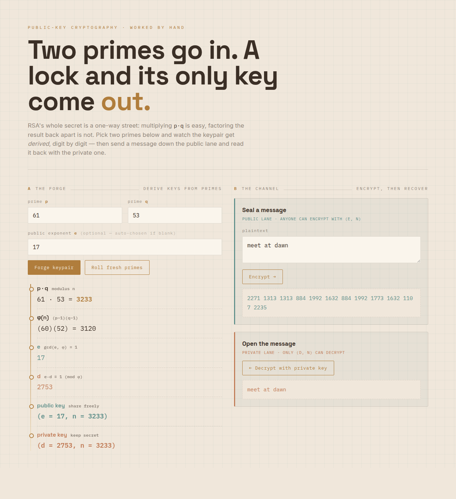

# RSA (Rivest-Shamir-Adleman)

## Aim

To implement RSA, a public-key cipher whose security rests on the difficulty of
factoring the product of two large primes. A keypair is derived from two primes
`p` and `q`: the public key `(e, n)` is shared, the private key `(d, n)` is kept
secret. A message is encrypted with the public key as `c = m^e mod n` and only
the matching private key recovers it as `m = c^d mod n`. This demonstrator works
on real integer arithmetic (BigInt) and encrypts one character code point per
block.



## Algorithm

Key generation is a one-time setup that produces the keypair used by encrypt and
decrypt.

```{=latex}
\begin{algorithm}[H]
\DontPrintSemicolon
\SetKwFunction{Keygen}{KeyGen}
\SetKwProg{Fn}{Function}{:}{}
\Fn{\Keygen{p, q}}{
  n $\gets$ p * q\;
  phi $\gets$ (p - 1) * (q - 1) \tcp*{Euler's totient of n}
  choose e with 1 $<$ e $<$ phi and gcd(e, phi) = 1 \tcp*{public exponent}
  d $\gets$ modular inverse of e mod phi \tcp*{via extended Euclid}
  \KwRet public (e, n) and private (d, n)\;
}
\end{algorithm}
```

```{=latex}
\begin{algorithm}[H]
\DontPrintSemicolon
\SetKwFunction{Encrypt}{Encrypt}
\SetKwProg{Fn}{Function}{:}{}
\Fn{\Encrypt{plain\_text, e, n}}{
  cipher $\gets$ empty list\;
  \ForEach{character ch in plain\_text}{
    m $\gets$ code point of ch\;
    \If{m $\geq$ n}{ error \tcp*{block too large; use bigger primes} }
    append (m raised to e) mod n to cipher \tcp*{fast modular exponentiation}
  }
  \KwRet cipher\;
}
\end{algorithm}

\begin{algorithm}[H]
\DontPrintSemicolon
\SetKwFunction{Decrypt}{Decrypt}
\SetKwProg{Fn}{Function}{:}{}
\Fn{\Decrypt{cipher, d, n}}{
  plain $\gets$ ""\;
  \ForEach{value c in cipher}{
    m $\gets$ (c raised to d) mod n\;
    append character with code point m to plain\;
  }
  \KwRet plain\;
}
\end{algorithm}
```

## Output

**Key generation** — primes `p = 17`, `q = 11`

| Quantity | Computation                     | Value |
|----------|---------------------------------|-------|
| n        | p * q = 17 * 11                 | 187   |
| phi      | (p - 1)(q - 1) = 16 * 10        | 160   |
| e        | smallest coprime with phi (> 1) | 17    |
| d        | inverse of e mod phi            | 113   |

Check: e * d mod phi = 17 * 113 mod 160 = 1, so encryption and decryption are
inverses. Public key = `(17, 187)`, private key = `(113, 187)`.

**Encrypt** — message `Hi` with public key `(e = 17, n = 187)`

Each character's code point is raised to `e` mod `n`:

| Char | Code (m) | c = (m raised to e) mod n     | Cipher |
|------|----------|-------------------------------|--------|
| H    | 72       | (72 raised to 17) mod 187     | 140    |
| i    | 105      | (105 raised to 17) mod 187    | 173    |

Result: `Hi` -> `[140, 173]`

**Decrypt** — cipher `[140, 173]` with private key `(d = 113, n = 187)`

Each cipher value is raised to `d` mod `n` to recover the code point:

| Cipher (c) | m = (c raised to d) mod n     | Code | Char |
|------------|-------------------------------|------|------|
| 140        | (140 raised to 113) mod 187   | 72   | H    |
| 173        | (173 raised to 113) mod 187   | 105  | i    |

Result: `[140, 173]` -> `Hi`

Every character code must be smaller than `n`; the primes here (n = 187) only fit
code points below 187, so real use needs far larger primes. An eavesdropper who
sees `(e, n)` and the cipher would have to factor `n` back into `p` and `q` to
find `d`, which is infeasible for large primes.
