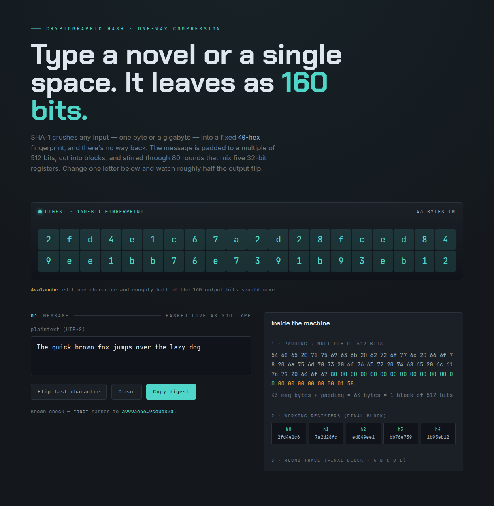

# SHA-1 (Secure Hash Algorithm 1)

## Aim

To implement SHA-1, a cryptographic hash that maps any message to a fixed
160-bit (40 hex character) digest. The message is padded to a multiple of 512
bits, split into blocks, and each block is run through 80 rounds that mix five
32-bit chaining registers. It is one-way (the input cannot be recovered from the
digest) and exhibits the avalanche effect (a one-bit change flips about half the
output bits). SHA-1 is now broken for security use, but remains a clean study of
how a hash is built.



## Algorithm

SHA-1 is a one-way digest, so there is no decrypt. The two core methods are
padding the message and compressing each block into the running hash.

```{=latex}
\begin{algorithm}[H]
\DontPrintSemicolon
\SetKwFunction{Pad}{Pad}
\SetKwProg{Fn}{Function}{:}{}
\Fn{\Pad{message}}{
  bits $\gets$ length of message in bits\;
  append the byte 0x80 to message\;
  \While{length mod 512 $\neq$ 448 bits}{ append a 0x00 byte\; }
  append bits as a 64-bit big-endian integer \tcp*{now a multiple of 512}
  \KwRet message split into 512-bit blocks\;
}
\end{algorithm}

\begin{algorithm}[H]
\DontPrintSemicolon
\SetKwFunction{Hash}{Digest}
\SetKwProg{Fn}{Function}{:}{}
\Fn{\Hash{message}}{
  (h0..h4) $\gets$ (67452301, EFCDAB89, 98BADCFE, 10325476, C3D2E1F0)\;
  \ForEach{block in \Pad{message}}{
    w[0..15] $\gets$ the sixteen 32-bit words of block\;
    \For{t $\gets$ 16 \KwTo 79}{
      w[t] $\gets$ (w[t-3] XOR w[t-8] XOR w[t-14] XOR w[t-16]) rot\_left 1\;
    }
    (a, b, c, d, e) $\gets$ (h0, h1, h2, h3, h4)\;
    \For{t $\gets$ 0 \KwTo 79}{
      (f, k) $\gets$ round constants for t \tcp*{4 stages of 20 rounds}
      tmp $\gets$ (a rotl 5) + f + e + k + w[t] \tcp*{all mod $2^{32}$}
      (e, d, c, b, a) $\gets$ (d, c, b rotl 30, a, tmp)\;
    }
    (h0..h4) $\gets$ (h0+a, h1+b, h2+c, h3+d, h4+e) \tcp*{mod $2^{32}$}
  }
  \KwRet h0 || h1 || h2 || h3 || h4 \tcp*{concatenate: 160-bit digest}
}
\end{algorithm}
```

The per-round `(f, k)` come in four stages of twenty rounds:

| Rounds t | f(b, c, d)                    | k        |
|----------|-------------------------------|----------|
| 0 - 19   | (b AND c) OR (NOT b AND d)    | 5A827999 |
| 20 - 39  | b XOR c XOR d                 | 6ED9EBA1 |
| 40 - 59  | (b AND c) OR (b AND d) OR (c AND d) | 8F1BBCDC |
| 60 - 79  | b XOR c XOR d                 | CA62C1D6 |

## Output

**Digest** — message `abc` (3 bytes)

Padding: append `0x80`, fill with zeros, then the 64-bit length `0x18` = 24 bits.
The message is short, so it forms a single 512-bit block:

```
61 62 63 80 00 00 00 00  00 00 00 00 00 00 00 00
00 00 00 00 00 00 00 00  00 00 00 00 00 00 00 00
00 00 00 00 00 00 00 00  00 00 00 00 00 00 00 00
00 00 00 00 00 00 00 00  00 00 00 00 00 00 00 18
```

The block is loaded as sixteen words (`w0 = 61626380`, `w1..w14 = 0`,
`w15 = 00000018`), expanded to 80 words, then stirred through the 80 rounds. The
five registers start at the fixed constants and evolve each round:

| Round t | a        | b        | c        | d        | e        |
|---------|----------|----------|----------|----------|----------|
| init    | 67452301 | EFCDAB89 | 98BADCFE | 10325476 | C3D2E1F0 |
| 0       | 0116FC33 | 67452301 | 7BF36AE2 | 98BADCFE | 10325476 |
| 1       | 8990536D | 0116FC33 | 59D148C0 | 7BF36AE2 | 98BADCFE |
| 2       | A1390F08 | 8990536D | C045BF0C | 59D148C0 | 7BF36AE2 |
| 3       | CDD8E11B | A1390F08 | 626414DB | C045BF0C | 59D148C0 |
| ...     | ...      | ...      | ...      | ...      | ...      |

After 80 rounds, the registers are added back into the running hash, giving the
final five words:

| Word | Value    |
|------|----------|
| h0   | A9993E36 |
| h1   | 4706816A |
| h2   | BA3E2571 |
| h3   | 7850C26C |
| h4   | 9CD0D89D |

Concatenating h0..h4 gives the 160-bit digest.

Result: `abc` -> `a9993e364706816aba3e25717850c26c9cd0d89d`

**Avalanche** — messages `...lazy dog` vs `...lazy cog`

A single-letter change scrambles most of the digest, showing the one-way mixing:

| Message                                      | Digest                                     |
|----------------------------------------------|--------------------------------------------|
| The quick brown fox jumps over the lazy dog  | `2fd4e1c67a2d28fced849ee1bb76e7391b93eb12` |
| The quick brown fox jumps over the lazy cog  | `de9f2c7fd25e1b3afad3e85a0bd17d9b100db4b3` |

One changed character flips 87 of the 160 output bits (about 54%). There is no
inverse operation: the digest cannot be turned back into the message.
